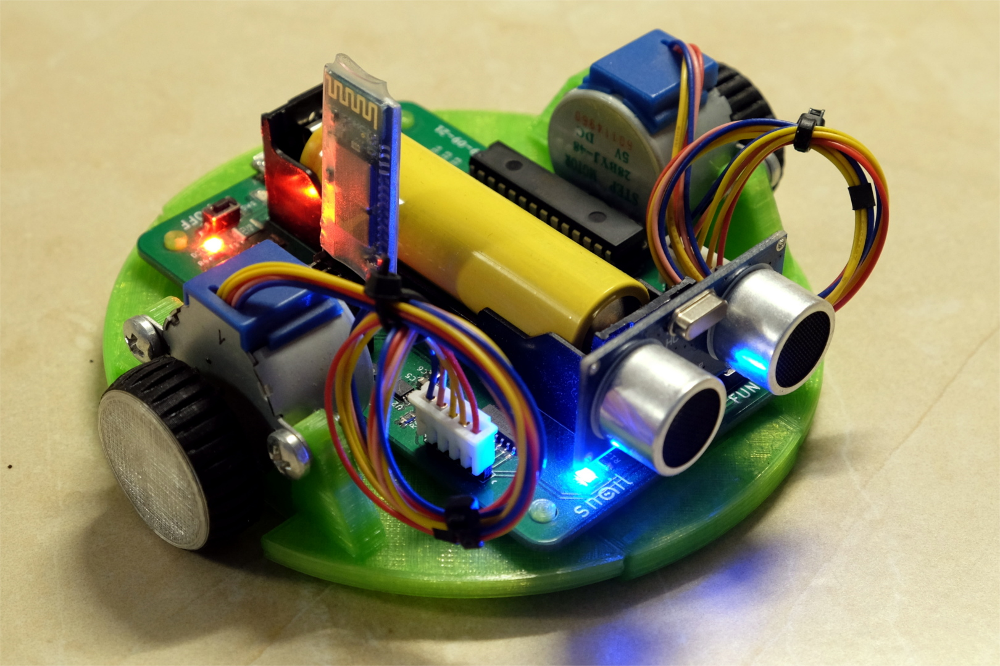

# snailbot
Arduino compatible robot platform

## Hardware
List of parts:
 - electronic components listed in the [BOM file](pcb/BOM.csv)
 - HC-SR04 ultrasonic distance sensor
 - HC05 bluetooth adapter
 - 18650 lithium-ion battery
 - 2x 28BYJ-48 stepper motors

## Dependencies
- AccelStepper v.1.59

## Chassis
For better traction, use TPU for the tires.
